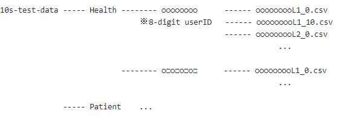

Cervical Myelopathy Screening
====
This page contains information about the screening software and program in the paper &quot;Cervical myelopathy screening with machine learning algorithm focusing on finger motion
using non-contact sensor&quot;.

## Requirement
- Leap Motion(Leap Motion, San Francisco, CA, USA)
- Unity
- Python

## Quick Start Overview
Install all files from the repository or copy the repository.

- Unity Application
1. Prepare a computer with a macOS (Apple Inc., Cupertino, CA, USA) and Leap Motion.
2. Uncompress the compressed file &quot;CM_screening-main&quot;.
3. Open the folder &quot;HANZM_exe&quot; and start HANZM ver2.1.
4. Put the 8-digit ID.
5. Perform the examination by gripping and releasing fingers 20 times on the Leap Motion according to the Measurements in the paper.
6. Get the examination data at HANZM_exe/HANZM ver2.1/Contents/Log.

- Python Software
6. Add the examination data from Unity into /10s-test-data/Patient/******** or /10s-test-data/Health/********.  
   ******** means 8-digit ID.  
   If the data is patient's one, add into the former. If else, add into the latter.
   
7. Examine data_check.py. This is the prepare for classification.
8. Examine fft_classification.py. After it, the classification result is shown.
